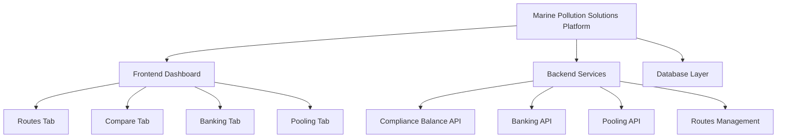

🌊 Overview

Marine Pollution Solutions is a full-stack platform designed to help simulate and manage greenhouse gas (GHG) compliance under the FuelEU Maritime Regulation (EU 2023/1805).

The application enables users to calculate, monitor, and compare compliance performance for various maritime routes. It also supports banking and pooling operations based on the latest EU sustainability standards.

This project showcases a modular architecture with a clear separation between backend and frontend layers, following Clean (Hexagonal) Architecture design principles.
---

🎯 Purpose
The goal is to create a lightweight yet structured Marine Pollution Compliance Management Platform that includes:

Interactive dashboard for Routes, Comparison, Banking, and Pooling

Backend APIs for route data, compliance computation, and balance adjustments

A domain-driven codebase built using React, TypeScript, and Node.js

---



✨ Core Features
🛳️ Route Management

Browse all available shipping routes

Filter routes by vessel type, fuel type, or year

Choose a baseline route for emission comparison

📉 Comparison Module

Compare selected routes with the baseline

Display GHG intensity, percentage differences, and compliance status

Visualize data using graphs and charts

💼 Banking (Article 20)

Compute Compliance Balance (CB) for each vessel

Bank surplus when emissions are below the target

Redeem or apply surplus to offset deficits

Prevent invalid or unfair transactions

🤝 Pooling (Article 21)

Create pools that share compliance balances among ships

Ensure equitable distribution and maintain total CB ≥ 0

Prevent any ship from exiting a pool with a lower CB

⚙️ Technology Stack
💻 Frontend

React.js + TypeScript + Vite

Tailwind CSS for styling

Context API for global state management

Chart.js / Recharts for analytics and visualization

RESTful API integration

⚙️ Backend

Node.js + Express + TypeScript

PostgreSQL database with Prisma ORM

Follows Hexagonal Architecture for scalability

Jest and Supertest for testing

ESLint + Prettier for clean and consistent code  

---

### 🧱 Project Architecture

```text

│
├── README.md
├── AGENT_WORKFLOW.md
├── REFLECTION.md
│
├── backend/
│   ├── jest.config.js
│   ├── package.json
│   ├── tsconfig.json
│   ├── .eslintrc.js
│   ├── prisma/
│   │   └── schema.prisma
│   ├── scripts/
│   │   └── seed.js
│   ├── src/
│   │   ├── prismaClient.ts
│   │   ├── adapters/
│   │   │   ├── inbound/http/
│   │   │   │   ├── bankingController.ts
│   │   │   │   ├── complianceController.ts
│   │   │   │   ├── poolsController.ts
│   │   │   │   └── routeController.ts
│   │   │   └── outbound/prisma/
│   │   │       ├── BankRepositoryPrisma.ts
│   │   │       ├── PoolRepositoryPrisma.ts
│   │   │       └── RouteRepositoryPrisma.ts
│   │   ├── core/
│   │   │   ├── application/usecases/
│   │   │   │   ├── banking.ts
│   │   │   │   ├── computeCB.ts
│   │   │   │   └── createPool.ts
│   │   │   └── domain/entities/
│   │   │       └── Route.ts
│   │   ├── infrastructure/server/
│   │   │   ├── app.ts
│   │   │   └── dev.ts
│   │   └── shared/constants.ts
│   └── tests/
│       ├── integration/
│       │   ├── routes.integration.test.js
│       │   └── routes.integration.test.ts
│       └── unit/
│           ├── computeCB.test.js
│           ├── computeCB.test.ts
│           ├── createPool.test.js
│           └── createPool.test.ts
│
└── frontend/
    ├── index.html
    ├── package.json
    ├── tsconfig.json
    ├── vite.config.ts
    ├── src/
    │   ├── adapters/
    │   │   ├── infrastructure/
    │   │   │   ├── apiClient.ts
    │   │   │   └── fetchHelpers.ts
    │   │   └── ui/
    │   │       ├── AppRouter.tsx
    │   │       ├── components/
    │   │       │   ├── Card.tsx
    │   │       │   ├── Sidebar.tsx
    │   │       │   └── Topbar.tsx
    │   │       └── pages/
    │   │           ├── BankingPage.tsx
    │   │           ├── ComparePage.tsx
    │   │           ├── DashboardPage.tsx
    │   │           ├── PoolingPage.tsx
    │   │           └── RoutesPage.tsx
    │   ├── core/
    │   │   ├── application/usecases/
    │   │   │   └── compute.ts
    │   │   └── domain/
    │   │       ├── Banking.ts
    │   │       └── Route.ts
    │   └── shared/constants.ts

```

## 🧮 Core Formula

### Compliance Balance (CB)

CB = (Target - Actual) × (Fuel Consumption × 41,000 MJ/t)


- **Target (2025):** 89.3368 gCO₂e/MJ  
- **Positive CB:** surplus → can bank or pool  
- **Negative CB:** deficit → must offset via banked or pooled surplus  

---

## 🌐 API Summary
###🚢 Routes
| Endpoint | Method | Description |
|---|---:|---|
| `/routes` | GET | Fetch all routes |
| `/routes/:id/baseline` | POST | Set a route as baseline |
| `/routes/comparison` | GET | Compare baseline with others |

### ⚖️ Compliance
| Endpoint | Method | Description |
|---|---:|---|
| `/compliance/cb?shipId&year` | GET | Compute CB snapshot |
| `/compliance/adjusted-cb` | GET | Return adjusted CB after banking |

### 💳 Banking
| Endpoint | Method | Description |
|---|---:|---|
| `/banking/bank` | POST | Bank positive CB |
| `/banking/apply` | POST | Apply banked surplus |

### 🤝 Pooling
| Endpoint | Method | Description |
|---|---:|---|
| `/pools` | POST | Create pool with multiple ships |
| `/pools` | GET | Retrieve pool details |

---

## 📊 Sample Dataset

| Route ID | Vessel Type | Fuel Type | Year | GHG Intensity | Fuel (t) | Distance (km) | Emissions (t) |
|---:|---|---|---:|---:|---:|---:|---:|
| R001 | Container | HFO | 2024 | 91.0 | 5000 | 12000 | 4500 |
| R002 | BulkCarrier | LNG | 2024 | 88.0 | 4800 | 11500 | 4200 |
| R003 | Tanker | MGO | 2024 | 93.5 | 5100 | 12500 | 4700 |
| R004 | RoRo | HFO | 2025 | 89.2 | 4900 | 11800 | 4300 |
| R005 | Container | LNG | 2025 | 90.5 | 4950 | 11900 | 4400 |


## 🧪 Testing

| Test Type | Framework | Description |
|---|---|---|
| Unit Tests | Jest | Tests computation of CB, banking, and pooling |
| Integration Tests | Supertest | Validates backend endpoints |
| Data Tests | Prisma | Ensures schema & seed integrity |
| Edge Cases | Manual | Tests invalid and boundary conditions |

---

## 🚀 Getting Started

### Clone Repository
```bash
git clone https://github.com/Prince-Dwivedi2024/Marine_pollution_solutions.git
cd Marine_pollution_solutions
```

### Backend Setup

```bash
cd backend
npm install
cp .env.example .env    # Add PostgreSQL credentials
npm run dev

```


## Frontend Setup
```bash
cd ../frontend
npm install
npm run dev

```

## Run Tests
```bash
npm run test
```


---

## 🧭 Evaluation Focus

| Area | Focus |
|---|---|
| Architecture | Clean hexagonal pattern, modular design |
| Functionality | Routes, Compare, Banking, Pooling modules implemented |
| Code Quality | TypeScript strict mode, linted and formatted |
| Testing | Unit & integration tests implemented and passing |
| Documentation | Clear, complete, and consistent README, plus AGENT_WORKFLOW.md & REFLECTION.md |
| Robustness | Proper validation, edge-case handling, and defensive programming |

---

## 📘 References

This project follows the methodology outlined in:

FuelEU Maritime Regulation (EU) 2023/1805, focusing on Annex IV and Articles 20–21

Main computation:
CB = (Target - Actual) × (Fuel Consumption × 41,000 MJ/t)

Refer to official EU documents for detailed compliance rules.
---

## 📝 Future Enhancements

Add seed data in prisma/seed.js

Extend test coverage for computeCB, createPool, and banking logic

Improve API schema validation

Add a sample Postman collection for testing

Optionally, maintain a CHANGELOG.md for development tracking
---

## 👨‍💻 Author

**Prince Dwivedi**  
---


